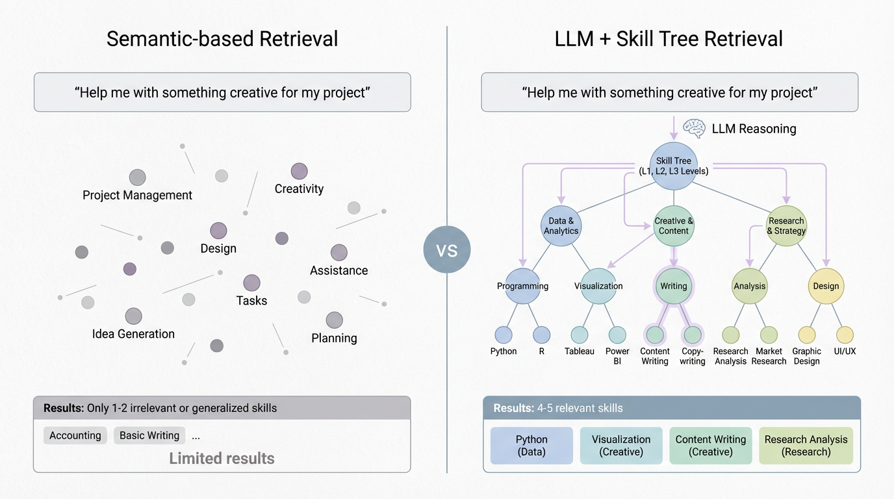
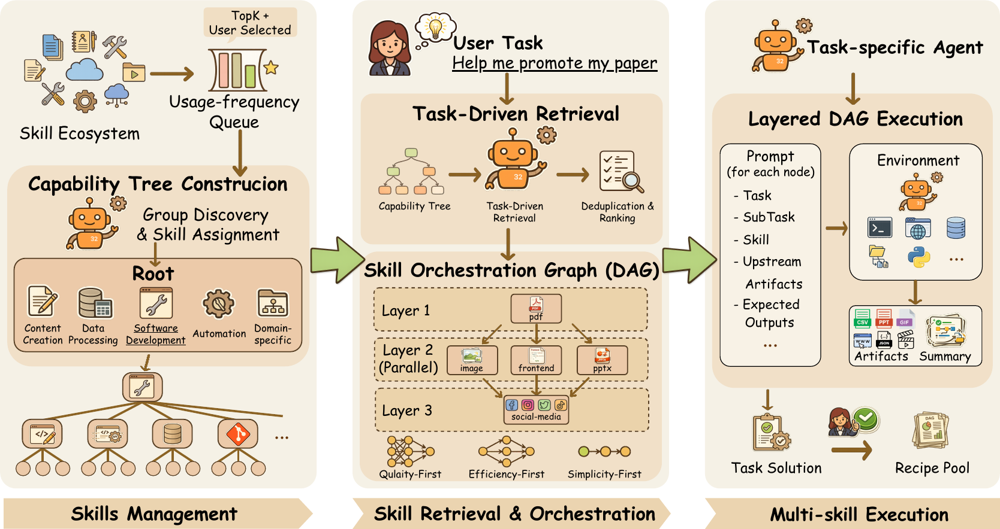

<p align="center">
  
</p>

<p align="center">
  
  
  <a href="https://github.com/ynulihao/AgentSkillOS"></a>
</p>

# Skill Retriever

> **AgentSkillOS-powered semantic skill retrieval for Hermes Agent.**

Pre-filters **439 skills** (230 permissively-licensed community + 209 Hermes skills) organized in a **10,000-category capability taxonomy** to the top-5 most relevant per query. The full corpus (1,197 skills) is available locally for opt-in use.

## Why a Skill Tree?

Pure semantic retrieval prioritizes textual similarity and misses skills that look unrelated in embedding space but are crucial for solving the task. Our LLM + Skill Tree navigates the capability hierarchy to surface non-obvious but functionally relevant skills.

<p align="center">
  
</p>
<sub><i>Left: Pure semantic retrieval is narrow and myopic. Right: Skill Tree navigation surfaces functionally relevant skills the embedding space hides.</i></sub>

## The Capability Tree

Skills are organized into a coarse-to-fine capability hierarchy. At scale, this is the difference between finding the right skill and drowning in an invisible pile.

<p align="center">
  
</p>
<sub><i>The 10,000-category capability tree — the structure our 1,200 skills are mapped into.</i></sub>

## How It Works

```                     
User Query
    │
    ▼
┌────────────────────────────────────────────────────────────┐
│ 1. <available_skills> compact block (system prompt)        │
│    Model knows what categories exist — ~1,200 tokens       │
└──────────────────────────┬─────────────────────────────────┘
                           │
                           ▼
┌────────────────────────────────────────────────────────────┐
│ 2. skill_hints plugin (pre_llm_call hook)                  │
│    If query matches a category, inject hint line           │
│    "💡 Relevant: docker-patterns, ..." (~50 tokens)         │
└──────────────────────────┬─────────────────────────────────┘
                           │
                           ▼
┌────────────────────────────────────────────────────────────┐
│ 3. skill_retrieve tool (model decides to call)              │
│    Searches 10K-category capability tree via LLM navigation│
│    Returns top-5 skills with descriptions + paths          │
│    Model can call skill_view(name) to load any             │
└────────────────────────────────────────────────────────────┘
```

## Why not just use Hermes OOTB?

Hermes already ships with skill discovery — every user-installed skill appears in the `<available_skills>` block of the system prompt. The LLM scans this list every turn and calls `skill_view()` when needed. For small sets it works fine.

skill-retriever adds **three layers** on top — passive awareness, proactive suggestion, and deep search — without removing any existing capability:

| Dimension | Legacy `<available_skills>` (full dump) | Current `<available_skills>` (compact) | `skill_hints` plugin | `skill_retrieve` tool |
|-----------|---------|---------|---------|---------|
| **Content** | All 264 skills (name+desc) | Category names + counts | Top-5 relevant skill names | Full skill metadata |
| **Token cost** | ~8K per turn 🔥 | ~1.2K per turn ✅ | ~50 tokens when triggered ✅ | 0 until called ✅ |
| **When triggered** | Every turn | Every turn | Query-category match | Model decides |
| **Discovery** | Scroll through flat list | See categories, infer contents | Proactive nudge | Deep semantic search |
| **Gap filled** | You had to read everything | You see the map | You get suggestions | You find exactly what fits |

**The old `skills_list` (dump all 264 skills in full) is vestigial** — replaced by the compact block. The three tiers together are cheaper and more effective than the original flat dump. The model pays a small fixed cost for the map, a tiny cost for suggestions, and zero for search until it chooses to dig deeper.

<p align="center">
  
</p>

## Quick Start

```bash
pip install skill-retriever
skill-retriever install          # install bundled community skills
skill-retriever search "..."     # search the capability tree
```

## What Skills Are Bundled

The package ships **230 permissively-licensed community skills** (MIT/Apache-2.0/BSD-3-Clause)
under `skill_retriever/community_skills/`. These come from the AgentSkillOS corpus
filtered to only include skills with clear open-source licenses:

| License | Count | Origin |
|---------|-------|--------|
| MIT | 173 | AgentSkillOS, vercel-labs/agent-skills, wshobson/agents |
| Apache-2.0 | 55 | AgentSkillOS, vibeship-spawner-skills |
| BSD-3-Clause | 2 | AgentSkillOS |

These are the skills you get immediately after `pip install` + `skill-retriever install`.
See [NOTICE](NOTICE) and `skill_retriever/community_skills/LICENSES.json` for
per-skill attribution.

## How Skills Reach the Model (3 Mechanisms)

skill-retriever integrates with Hermes Agent via three complementary mechanisms.
Each serves a different purpose — removing any one creates a gap.

### 1. 📋 `<available_skills>` — Passive Scan

```
Injected in system prompt every turn:
📚 Available Skills (439 total)
  ├─ Automation (52)
  ├─ Content Creation (48)
  ├─ Data Processing (41)
  ├─ Development (197)
  └─ Domain Specific (101)
```

**What:** A compact block in the system prompt showing skill categories
and counts. The model always sees this — it knows what's available
without calling any tool.
**When to use:** Casual discovery. "What skills do I have for X?"
**Cost:** ~1,200 tokens per turn (categories only, not full listings).
**Gap it fills:** Zero-latency awareness. The model can't search for
something it doesn't know exists.

### 2. 🔍 `skill_retrieve` Tool — Active Search

```
The model decides to call: skill_retrieve(query="set up CI/CD pipeline")
→ Returns top-5 skills from the capability tree with descriptions + paths
```

**What:** A Hermes tool the model calls when it needs a specific skill
for the task at hand. Searches the 10,000-category capability tree using
LLM navigation to find the most relevant skills.
**When to use:** The model has a concrete task and needs the right skill.
**Cost:** 0 tokens until called, then ~1-3 LLM calls for tree traversal.
**Gap it fills:** Deep discovery. The compact block only shows categories —
the tool can find the exact skill from 439 candidates.

### 3. 💡 `skill_hints` Plugin — Proactive Injection

```
System pre-pends to user message:
💡 Relevant skills: docker-patterns, deployment-patterns, container-app-serving
→ model can call skill_view() on any of them
```

**What:** A `pre_llm_call` plugin that runs the search automatically and
injects a short hint list when relevant skills are found. The model can
then call `skill_view()` to load any hinted skill.
**When to use:** The user's query strongly matches a skill category.
The system suggests before the model asks.
**Cost:** ~50 tokens for the hint line (only when triggered).
**Gap it fills:** Proactive awareness. The model doesn't have to remember
to search — the system pushes relevant skills when it detects a match.

### Why All Three?

| Mechanism | Trigger | Latency | Token Cost | Purpose |
|-----------|---------|---------|------------|---------|
| `<available_skills>` | Every turn | 0 | ~1,200 | Awareness: "what exists" |
| `skill_retrieve` tool | Model decision | 1-3 LLM calls | 0 until used | Precision: "find the right one" |
| `skill_hints` plugin | Query match | ~50ms | ~50 | Serendipity: "you might need this" |

The old approach (`skills_list`) dumped all 264 skills into the prompt
every turn — expensive and noisy. The compact block replaced it.
This three-tier system is more efficient: the model pays a small fixed
cost for awareness, zero cost for search until needed, and a tiny cost
for proactive suggestions when they're relevant.

### File-Level Loading (for completeness)

Physically, the skill SKILL.md files come from three directories:

| Source | Path | Contents |
|--------|------|----------|
| Package-bundled | `skill_retriever/community_skills/` | 230 permissively-licensed ✨ |
| Hermes installation | `~/.hermes/skills/` | ~165 user Hermes skills |
| Hermes source | `~/.hermes/hermes-agent/skills/` | ~44 built-in skills |
| User-installed | `~/.hermes/skills/imported/` | Via `skill-retriever install` |

## System Prompt Configuration

The `<available_skills>` block in Hermes' system prompt has three possible
formats. Only the **compact** format is recommended with skill-retriever.

### Three Formats

| Format | Content | Token Cost | Recommendation |
|--------|---------|------------|----------------|
| **Full dump** (legacy) | All skill names + descriptions | ~8,000 | ❌ Remove — vestigial |
| **Compact** ✅ | Category names + counts | ~1,200 | ✅ Keep — essential map |
| **Disabled** | Nothing | 0 | ⚠️ Only if hints + tool cover everything |

### How to configure

In Hermes' system prompt template or skills configuration, ensure the
`<available_skills>` block uses compact format. This is controlled by
Hermes configuration — refer to Hermes Agent docs for the exact setting.

Example compact output:
```
📚 Available Skills (439 total)
  ├─ Automation (52)
  ├─ Content Creation (48)
  ├─ Data Processing (41)
  ├─ Development (197)
  └─ Domain Specific (101)
```

### Can the compact block be removed entirely?

**Not recommended.** The compact block fills the "awareness" gap:

- `skill_hints` only fires when a query matches a category. If the user
  asks something vague, no hints are injected and the model sees nothing.
- `skill_retrieve` requires the model to decide to call it. Without a
  map of what exists, the model won't know to search.
- The compact block costs ~1,200 tokens (~0.6% of a 200K context) and
  ensures the model always has a high-level view of available capabilities.

The three tiers are **complementary** — removing the compact block creates
a blind spot that the other two can't fully cover. The old full dump
(8K tokens) is the only format you should remove.

## Trust & Safety

Every skill carries a **source tag**:

| Badge | Meaning |
|-------|---------|
| `🔒hermes` | Installed via Hermes — trusted |
| `🌐community` | From AgentSkillOS corpus — license varies |

### License Audit Process

All 1,197 skills referenced in the full tree were traced to their original
sources and their licenses resolved. Summary:

| License | Count | Ship-safe? |
|---------|-------|-----------|
| MIT | 173 | ✅ |
| Apache-2.0 | 55 | ✅ |
| BSD-3-Clause | 2 | ✅ |
| **Unlicensed** | **763** | ❌ |
| Proprietary | 4 | ❌ |
| AGPL-3.0 | 1 | ❌ |

The default capability tree (`tree_10000_ship_safe.yaml`) includes only the
230 permissively-licensed community skills + 209 hermes skills.
The full tree is available locally for expert use.

See [NOTICE](NOTICE) for full attribution.

## CLI

```bash
python -m skill_retriever search "set up CI/CD pipeline"
python -m skill_retriever build              # rebuild capability tree
python -m skill_retriever list               # list all skills in corpus
python -m skill_retriever info               # system info + tree stats
python -m skill_retriever install            # install bundled community skills
python -m skill_retriever audit              # check licenses of installed skills
```

### Installing Skills

The package bundles **230 permissively-licensed community skills** (MIT/Apache/BSD).

Install them to your Hermes skills directory:

```bash
skill-retriever install
# or explicitly:
skill-retriever install community --dest ~/.hermes/skills
```

You can also install skills from any directory of SKILL.md files:

```bash
skill-retriever install from-dir /path/to/my/skills
```

### License Audit

Check the licensing status of all your installed skills:

```bash
skill-retriever audit
```

Output shows per-license counts and flags any unlicensed skills.

### Licensing Model

| Component | Status |
|-----------|--------|
| Package code | MIT |
| 230 bundled community skills | MIT/Apache/BSD ✅ shipped with package |
| 768 unlicensed community skills | 🔒 Not bundled — use locally only |
| Hermes skills (references) | Apache 2.0 — unmodified, not bundled |

The full `tree_10000.yaml` references 1,197 skills (including unlicensed ones).
It is kept for local use but only the ship-safe tree is the default.
To switch to the full tree: `export SKILL_RETRIEVER_TREE_PATH=.../tree_10000.yaml`

**Important:** Unlicensed skills are "all rights reserved" by default.
Do not redistribute them without checking original sources.
Run `skill-retriever audit` on your installation before sharing any skills.

## Configuration

All settings via environment variables — no config files needed.

| Env Variable | Default | Description |
|-------------|---------|-------------|
| `SKILL_RETRIEVER_DISABLE` | — | Set `1` to disable entirely |
| `SKILL_RETRIEVER_LLM_MODEL` | `gpt-4o` | LLM model for skill gate |
| `SKILL_RETRIEVER_LLM_API_KEY` | `OPENAI_API_KEY` | API key |
| `SKILL_RETRIEVER_LLM_BASE_URL` | `OPENAI_BASE_URL` | Base URL |
| `SKILL_RETRIEVER_BRANCHING_FACTOR` | `3` | Tree branching (search) |
| `SKILL_RETRIEVER_MAX_PARALLEL` | `5` | Parallel search branches |
| `SKILL_RETRIEVER_TEMPERATURE` | `0.3` | LLM temperature |
| `SKILL_RETRIEVER_PRUNE` | `true` | Enable dedup/ranking step |
| `SKILL_RETRIEVER_TREE_PATH` | bundled `tree_10000.yaml` | Override capability tree |

## Architecture

See [ARCHITECTURE.md](ARCHITECTURE.md) for a technical deep-dive covering:

- Capability tree structure and build process
- LLM node selection algorithm
- Searcher internals (parallel search, early stop, pruning)
- Plugin hook integration
- Directory layout

## Requirements

- Hermes Agent v0.18+
- Python 3.10+
- ~500MB for capability tree index
- ~4GB for full skill corpus (optional, for rebuilding tree)

## Project Structure

```
skill-retriever/
├── plugin/                 # Hermes plugin (pre_llm_call hook)
├── src/
│   ├── skill_retriever/    # Core engine
│   │   ├── cli.py          # CLI (search, build, list, info)
│   │   ├── search/         # Searcher (multi-level LLM tree search)
│   │   ├── tree/           # Tree builder, schema, prompts, scanner
│   │   └── capability_tree/# Pre-built trees (YAML + HTML)
│   └── scanner.py  # Hermes skills scanner
├── data/                   # Skill corpus (gitignored)
├── tests/                  # 40 tests
├── scripts/install.sh      # One-click Hermes plugin install
└── ARCHITECTURE.md
```

## License

Package code: MIT. See [NOTICE](NOTICE) for third-party skill license
attribution.

Community skills: MIT / Apache-2.0 / BSD-3-Clause (230 bundled).
~768 unlicensed skills not bundled — use locally only.

Built on [AgentSkillOS](https://github.com/ynulihao/AgentSkillOS) (MIT).
